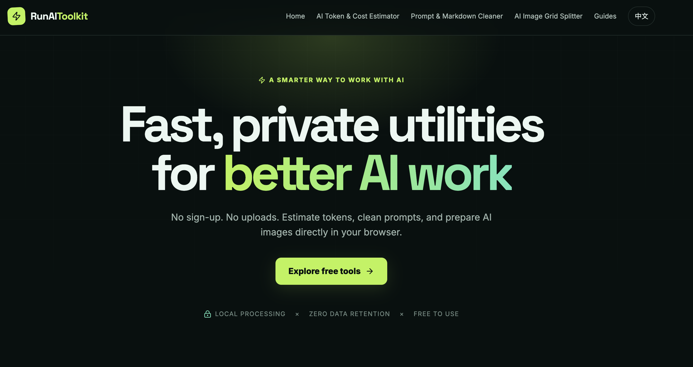

<H1>👋 Welcom to RunAIToolkit</H1>
    

   <strong>免费、私密的 AI 实用工具 | RunAIToolkit</strong>

## aRunAIToolkit工具简介

# 🚀 RunAIToolkit — 纯前端、零延迟的开发者与创作者 AI 微工具箱

> 🔗 **在线体验**：[https://runaitoolkit.com](https://runaitoolkit.com)

**RunAIToolkit** 是一个专为 AI 开发者、Prompt 工程师和数字创作者打造的轻量级、纯前端 AI 工具箱。

市面上大多数在线工具往往存在**高延迟、强制上传数据、界面臃肿或按次收费**的问题。RunAIToolkit 采用 **100% 浏览器端（Client-Side）架构**，所有计算与文本/图像处理均在本地内存完成，**零服务器响应等待，数据永不出本地**。

---

### 🛠️ 核心功能组件

#### 1. 🧮 [AI Token & API Cost Estimator](https://runaitoolkit.com/tools/ai-token-calculator)

* **功能**：精准计算输入文本的 Token 数量，并实时估算主流 LLM（包括 GPT-4o、Claude 3.5、DeepSeek R1 等）的 API 调用成本。
* **特点**：在 Web Worker 中进行分词计算，大文本输入也不会卡顿 UI，帮助开发者在批量跑 Prompt 前精确控本。

#### 2. 🧹 [Prompt & Markdown Cleaner](https://www.google.com/search?q=https://runaitoolkit.com/tools/prompt-markdown-cleaner)

* **功能**：一键清洗 LLM 输出文本中的系统冗余标记、不可见 Unicode 字符、混乱的 Markdown 格式及代码块伪影。
* **特点**：极速正则清洗，输出干净标准化文本，直接对接代码库、CMS 或下一阶段的 Prompt 链式调用。

#### 3. ✂️ [Midjourney & Flux Grid Splitter](https://runaitoolkit.com/tools/midjourney-grid-splitter)

* **功能**：将 Midjourney、Flux 或 Stable Diffusion 生成的 2x2 四格宫格图一键切分为 4 张无损高清单图。
* **特点**：基于本地 HTML5 Canvas (`ctx.drawImage`) 渲染，无需上传图像到后端，毫秒级导出，原图质量零衰减。

---

### ⚡ 隐私与架构优势

* **数据绝对隐私（Privacy-First）**：无论是敏感的 Prompt 提示词、商业 API 文本还是个人图片，**100% 不经过任何第三方服务器**，完全符合严苛的数据合规与 NDA 要求。
* **零延迟（Zero Latency）**：充分利用现代浏览器 JS 引擎与 Web Workers，免去 API 往返请求时间。
* **极致性能（Edge Served）**：基于 Next.js App Router 静态导出 (`output: 'export'`)，部署于 Cloudflare 全球 Anycast 边缘网络，首字节响应（TTFB）低于 50ms。
* **零运维成本（$0/Month Server Cost）**：无后端 API、无 Serverless 算力开销，确保工具能够长期稳定免费运营。

---

### 🛠️ 技术栈

* **Framework**: Next.js (App Router, SSG Static Export)
* **Styling & UI**: Tailwind CSS + Shadcn/ui
* **Core Logic**: Pure Client-Side JavaScript / HTML5 Canvas / Web Workers
* **Deployment**: GitHub Actions + Cloudflare Pages CDN

---

### 💬 反馈与建议

如果你在使用过程中遇到任何问题，或希望看到更多纯前端运行的 AI 微工具，欢迎在 Issues 中提出或前往 [runaitoolkit.com](https://runaitoolkit.com) 体验反馈！

